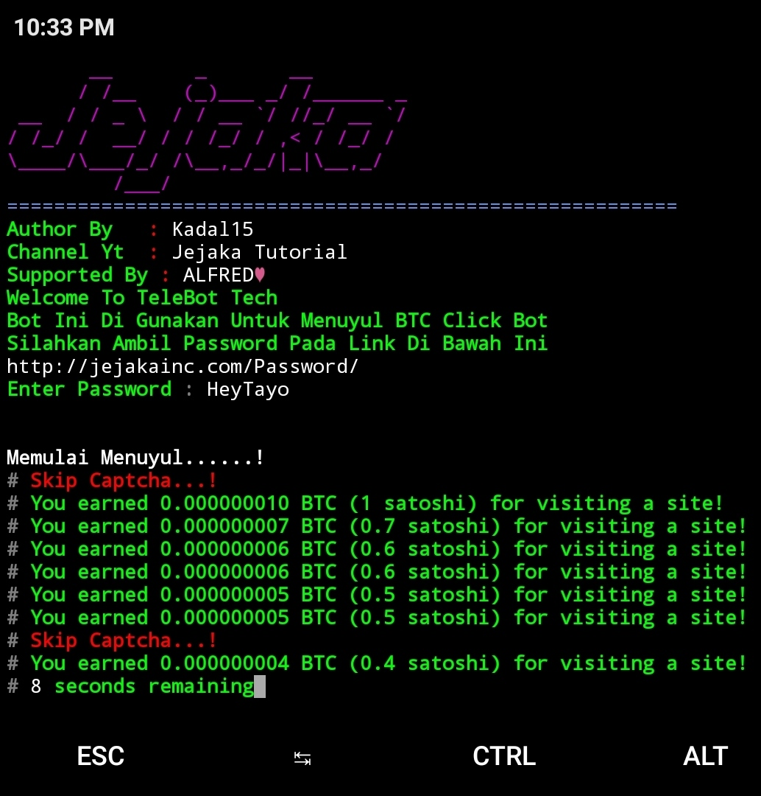
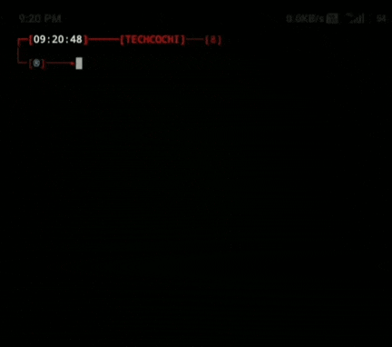

# telegram_bitcoin_bot

Telegram Auto Mining Bitcoins In Termux

# telegram botchannel link [](https://t.me/BitcoinClick_bot?start=fHQR)

# script by kadal15

channel yt : jejakka tutorial

supported by : ALFRED❤️

## Auto Mining BTC Click Bot

<br>
<p align="center">


</p>

## How to Install

Open the terminal and type following commands!!!

* ```apt update```
* ```apt upgrade```
* ```pkg install git```
* ```termux-setup-storage```
* ```pkg install pip```
* ```pkg install python```
* ```git clone https://github.com/rixon-cochi/telegram_bitcon_bot```
* ```cd telegram_bitcoin_bot```
* ```unzip telethon.zip```
* ```unzip session.zip```
* ```pip install -r requirements.txt```
* ```python bot.py```

## TECH COCHI TERMUX VIDEO PREVIEW




## [+] Find Me

[](https://github.com/rixon-cochi)
[](https://www.youtube.com/channel/UCdUnJ0qjDZ-psQYtgyoEl9Q)
[](https://t.me/techcochiyoutuber)
 


